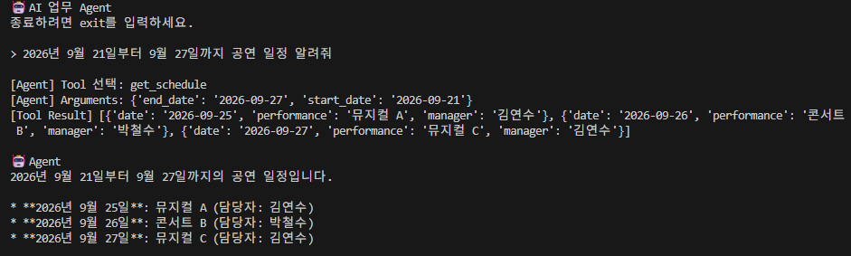
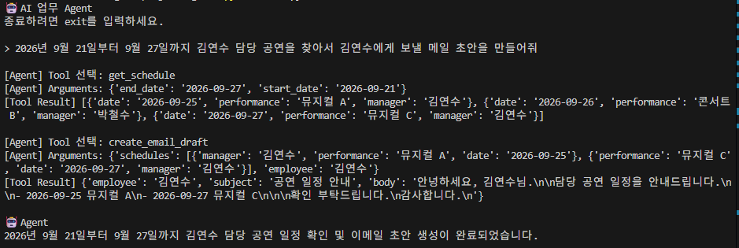
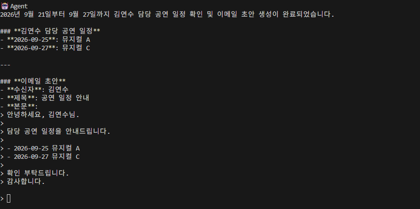

# 🤖 Python AI Agent 업무 자동화

> 기존 **n8n 업무 자동화**를 Python 기반 **AI Agent**로 재구현하는 프로젝트입니다.

단순 Workflow 실행이 아닌,
**AI Agent가 사용자의 요청을 이해하고 필요한 Tool을 직접 선택·실행**하는 구조를 구현합니다.
----
## ai이용한 단순 화면조회


## ai이용하여 데이터조회 + 메일 초안 작성


---

## 🎯 Goal

기존 n8n 자동화

```text
Trigger → Schedule 조회 → 담당자 조회 → Email 생성 → 발송
```

⬇️

AI Agent 기반 자동화

```text
"이번 주 공연 일정 담당자들에게 보내줘"

→ 요청 이해
→ 필요한 Tool 판단
→ 데이터 조회
→ 이메일 생성
→ 사용자 확인
→ 발송
```

---

## 🏗️ Architecture

```text
          👤 User
             │
             ▼
        🤖 AI Agent
       (LLM + 판단)
             │
       ┌─────┼─────┐
       ▼     ▼     ▼
   📅 Schedule 👥 Employee ✉️ Email
      Tool       Tool       Tool
       │          │          │
       ▼          ▼          ▼
      CSV       SQLite      SMTP
                  │
                  ▼
          ✅ Human Approval
```

Agent는 사용자의 요청에 따라 필요한 Tool을 선택하고 실행합니다.

---

## 🧠 Agent Flow

```text
User Request
     ↓
🧠 Reason
     ↓
🛠️ Tool 선택
     ↓
⚡ Action
     ↓
👀 Observation
     ↓
🧠 다음 행동 판단
     ↓
✅ Final Answer
```

**Reason → Action → Observation** 구조의 Agent Loop를 직접 구현합니다.

---

## 🛠️ Tools

| Tool               | 역할             |
| ------------------ | -------------- |
| 📅 `Schedule Tool` | 공연 일정 조회       |
| 👥 `Employee Tool` | 담당자 정보 조회      |
| ✉️ `Email Tool`    | 이메일 생성 및 발송    |
| ✅ `Human Approval` | 실제 발송 전 사용자 승인 |

---

## 📂 Project Structure

```text
ai-agent/
│
├── 🚀 main.py
├── 🤖 agent.py
├── 🛠️ tools.py
│
├── data/
│   ├── schedule.csv
│   └── employee.db
│
├── 🔐 .env
├── 📦 requirements.txt
└── 📖 README.md
```

---

## ⚙️ Tech Stack

🐍 **Python**
🤖 **LLM / Tool Calling**
📄 **CSV**
🗄️ **SQLite**
✉️ **SMTP**

---

## 🚀 Development

**STEP 1.** 기존 n8n Workflow Python 구현
**STEP 2.** 기능별 Tool 분리
**STEP 3.** AI Agent + Tool Calling 구현
**STEP 4.** Agent Loop 구현
**STEP 5.** Human Approval 추가
**STEP 6.** Logging / Error Handling 추가

---

## 💡 핵심 목표

> **“정해진 Workflow를 실행하는 자동화”에서
> “상황을 판단하고 Tool을 선택하는 AI Agent 자동화”로 확장**

LLM API를 단순 호출하는 것이 아니라,
**Agent의 판단 → Tool 실행 → 결과 확인 → 다음 행동 결정** 과정을 직접 구현하는 것이 이 프로젝트의 핵심입니다.
